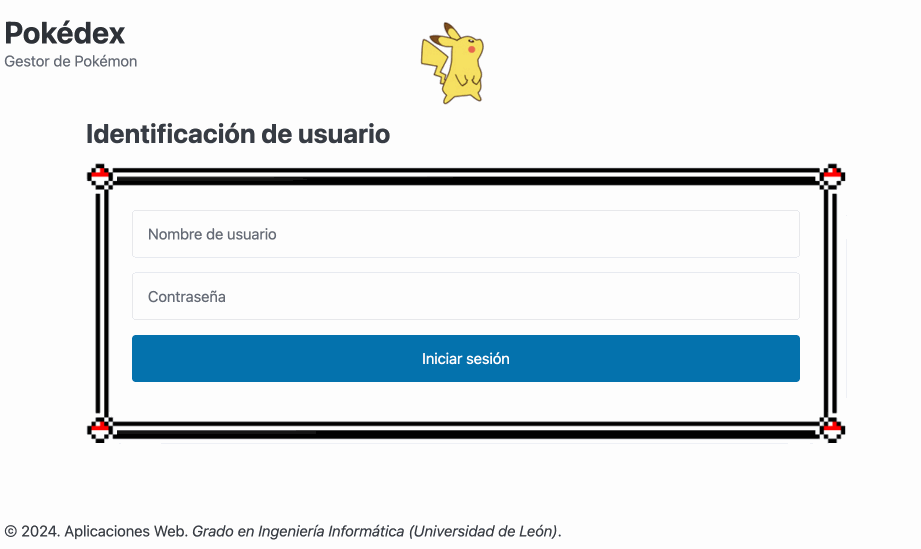

[](https://classroom.github.com/a/cNaCIaXj)
[](https://classroom.github.com/open-in-codespaces?assignment_repo_id=15310499)
# Aplicaciones Web (Grado en Ingeniería Informática. Universidad de León)

## PRÁCTICA OBLIGATORIA. SEGUNDA CONVOCATORIA (JUNIO 2024)

* Para la segunda convocatoria es **obligatorio** entregar esta tarea, la cual supondrá el **25% de la nota de prácticas**. El **75% restante se obtendrá mediante la realización de una defensa individual el día 27 de junio de 2024**.
* La entrega deberá ser **individual y no por grupos**, ya que cada estudiante realizará su defensa sobre la **tarea que haya entregado**.
* **No se tendrá en cuenta la práctica desarrollada en grupo de la primera convocatoria**.

## Requisitos

- [GitHub Codespaces](https://docs.github.com/en/codespaces/overview)
- [Visual Studio Code](https://code.visualstudio.com/)

## Referencias

- [jsonwebtoken@npm](https://www.npmjs.com/package/jsonwebtoken)
- [cookie-parser@npm](https://www.npmjs.com/package/cookie-parser)
- [Node.js Documentation@Node.js](https://nodejs.org/docs/latest/api/)
- [npm Docs@npm](https://docs.npmjs.com/)
- [4.x API@Express](https://expressjs.com/en/4x/api.html)
- [JavaScript reference@MDN Web Docs](https://developer.mozilla.org/en-US/docs/Web/JavaScript/Reference)

## Enunciado

A partir de una aplicación web que permite gestionar una colección de Pokémon, implementar **de forma individual** un sistema de autenticación de usuarios, restringiendo el acceso de una parte del frontend y de toda la API REST de Pokémon a aquellos clientes que no estén autenticados en el sistema.



### Estructura

Inicialmente, el proyecto ya contiene todos los elementos para construir la estructura de la aplicación web y está organizado de la siguiente manera:

```
.
├── public/                         # Frontend de la aplicación web
└── src/                            # Backend de la aplicación web
    ├── controllers/                # Controladores (Express)
    │   ├── authentication.js       # Módulo para gestionar peticiones HTTP en la API REST de autenticación
    │   └── pokemon.js              # Módulo para gestionar peticiones HTTP en la API REST de Pokémon
    ├── middlewares/                # Middleware (Express)
    │   ├── logger.js               # Módulo de logging de peticiones HTTP
    │   └── protector.js            # Módulo para proteger el acceso a URLs
    ├── models/                     # Modelos de datos
    │   ├── db.js                   # Módulo para gestionar la conexión a la base de datos
    │   └── pokemon.js              # Módulo para simular un modelo de datos de Pokémon
    ├── routes/                     # Rutas (Express)
    │   ├── authentication.js       # Módulo para definir los endpoints de la API REST de autenticación
    │   ├── frontend.js             # Módulo para definir los endpoints del frontend
    │   └── pokemon.js              # Módulo para definir los endpoints de la API REST de Pokémon
    ├── views/                      # Vistas (Express)
    │   └── error.ejs               # Plantilla EJS para generar una página de error
    └── app.js                      # Punto de entrada de la aplicación web
```

Esta organización sigue el [estilo Modelo-Vista-Controlador](https://expressjs.com/en/starter/faq.html#how-should-i-structure-my-application) sugerido por Express.

## Ejercicio 1: Inicialización del proyecto (10 puntos)

Modificar el fichero `package.json` para actualizar las siguientes propiedades con los valores apropiados: `author`, `repository` y `homepage`. Una vez hecho esto, es necesario instalar las dependencias asociadas al proyecto utilizando el comando:

```console
$ npm install
```

A continuación, crear un fichero `.env` ubicado en el directorio raíz del proyecto con el siguiente contenido:

```
# Puerto utilizado por el servidor de la aplicación (3000)
EXPRESS_PORT=
# URI de la base de datos (la propia creada para MongoDB Atlas en el Laboratorio 09)
MONGODB_URI=
```

En otro orden de cosas, el frontend de esta aplicación web está organizado de la siguiente manera:

* `public/index.html` es la página de inicio que contiene un formulario para la identificación de usuarios. La finalidad de esto es que si un usuario introduce correctamente su login y contraseña será redireccionado a la página `public/pokedex.html`. Por motivos de simplificación, en esta tarea solo habrá un usuario cuyo nombre de usuario y contraseña es `oak`.
  * Hay un módulo asociado a esa página `public/assets/js/index.mjs` para gestionar los eventos asociados a la misma.
* La página `public/pokedex.html` es la antigua página de inicio utilizada en los laboratorios semanales. Sin embargo, esta página se ha modificado para agregar un botón que permita a un usuario cerrar la sesión. Si un usuario cierra sesión correctamente será redireccionado a la página `public/index.html`.
  * Se ha renombrado el módulo asociado a esa página como `public/assets/js/pokedex.mjs`, que era el encargado de gestionar los eventos asociados a la misma.

La idea detrás de esta refactorización del frontend es hacer que **solo aquellos clientes que estén autenticados** puedan acceder a la aplicación web de gestión de Pokémon (es decir, tanto a la página web como a la API REST). Ya que esto afecta a la manera en la que el servidor web debe servir el contenido estático, se ha creado un nuevo enrutador `src/routes/frontend.js` cuya finalidad es separar responsabilidades del punto de entrada de la aplicación `src/app.js` y definir únicamente aquellos endpoints relativos al frontend.

Teniendo en cuenta esto, implementar el módulo `src/routes/frontend.js` según se indique en los comentarios y modificar `src/app.js` para cargar el nuevo enrutador y servirlo en el path `/`.

## Ejercicio 2: Cookies, token JWT y protección de URLs (25 puntos)

A pesar de que el protocolo HTTP no tiene estado, mecanismos como las [cookies](https://developer.mozilla.org/en-US/docs/Web/HTTP/Cookies) y los [token JWT](https://jwt.io/) permiten simularlo. La combinación de ambas habilita la implementación de una sesión, es decir, de información que un servidor almacena de forma temporal para identificar a un cliente específico dentro de una aplicación web.

Por un lado, las cookies son pequeños ficheros de texto que almacenan información relacionada sobre el estado de las comunicaciones entre un cliente y un servidor. Esto permite, entre otras cosas, gestionar las sesiones de los usuarios dentro de una aplicación web. El paquete [cookie-parser](https://www.npmjs.com/package/cookie-parser) permite gestionar cookies dentro de una aplicación de Express, analizando las cabeceras de las peticiones y respuestas HTTP.

Por otro lado, un token JWT es un mecanismo que permite transmitir información de manera compacta y segura utilizando una cadena de texto codificada (token). El paquete [jsonwebtoken](https://www.npmjs.com/package/jsonwebtoken) implementa este mecanismo permitiendo crear y decodificar tokens JWT.

Dicho esto, el módulo `src/middlewares/protector.js` define un middleware para proteger el acceso a URLs utilizando precisamente una combinación de cookies y tokens JWT. En otras palabras, este middleware solo permite acceder a una URL si el cliente posee un token JWT válido. Para poder crear (firmar) o validar tokens JWT, es necesario definir un [secreto criptográfico](https://en.wikipedia.org/wiki/Secure_Hash_Algorithms). Agregar al fichero `.env` una variable `JWT_TOKEN_SECRET` para almacenar dicho secreto y asignarle el valor resultante de ejecutar el siguiente comando:

```console
$ node -e "console.log(require('crypto').randomBytes(32).toString('hex'))"
```

Teniendo en cuenta lo anterior:

* Instalar los paquetes `cookie-parser` y `jsonwebtoken` como dependencias normales.
* Modificar `src/middlewares/protector.js` para implementar el método `protectURL()` según se indica en los comentarios (ver documentación de ambos paquetes).
* Después, modificar `app.js` según se indica en los comentarios para cargar el middleware de `cookie-parser` y para utilizar el middleware `protectURL` a fin de proteger el acceso a todos los endpoints de la API REST de Pokémon `/api/pokemon`.
* Finalmente, modificar `src/routes/frontend.js` para utilizar el middleware `protectURL` únicamente sobre el endpoint `/pokedex` para proteger su acceso.

## Ejercicio 3: Creación de una API REST para la autenticación de clientes (25 puntos)

Los módulos `src/routes/authentication.js` y `src/controllers/authentication.js` definen, respectivamente, un enrutador para ofrecer una API REST de autenticación de usuarios y un controlador asociado con una colección de manejadores.

La idea de esta API REST es que cuando un usuario se identifique correctamente, el servidor generará un token JWT (con la información de ese usuario) y este se enviará siempre en la respuesta a través de una [cookie de tipo HttpOnly](https://developer.mozilla.org/en-US/docs/Web/HTTP/Headers/Set-Cookie#httponly) denominada `jwt_token`; haciendo que la transferencia del token entre cliente y servidor sea siempre segura ya que el cliente no podrá acceder ni modificar el contenido de la cookie desde el código JavaScript. El acceso se revocará o bien cuando caduque la cookie (pasado un período de tiempo) o bien cuando un usuario quiera cerrar la sesión. En este último caso, el servidor deberá eliminar la cookie asociada al token JWT antes de enviar la respuesta para así terminar la comunicación. Para simplificar el sistema de usuarios, en esta tarea se supone que existe un único usuario en el sistema cuyo nombre de usuario y contraseña es `oak` (no hace falta crear un modelo de datos, simplemente verificar esos valores en el manejador correspondiente).

Basándose en todo lo anterior y en la [documentación de jsonwebtoken](https://www.npmjs.com/package/jsonwebtoken), modificar ambos ficheros para implementar su funcionalidad según se indique en los comentarios. Luego, modificar el fichero `app.js` para poder servir la API REST de autenticación sobre el path `/api/auth`.

## Ejercicio 4: Adaptación del frontend al nuevo backend (25 puntos)

Dado que el frontend sufrió una serie de cambios a fin de implementar como característica la autenticación de usuarios, es necesario realizar las siguientes modificaciones para adaptarlo a las nuevas funcionalidades:

* Modificar el fichero `public/assets/js/modules/rest-api.mjs` para que todos los métodos añadan la cabecera `credentials: include`. Esto permitirá al cliente enviar al servidor la cookie asociada al token JWT de forma automática en la petición.
  * Modificarlo también para implementar los métodos `loginUser` y `logoutUser` que permitan a un usuario iniciar y cerrar sesión en la aplicación web utilizando la nueva API REST implementada.
* Modificar los ficheros `public/assets/js/index.mjs` y `public/assets/js/pokedex.mjs` según se indique en el código para implementar los manejadores de eventos asociados.
  * Para que el navegador pueda redireccionar a una página es necesario utilizar el método [window.location.replace()](https://developer.mozilla.org/en-US/docs/Web/API/Location/replace) e indicar los endpoints del frontend implementados en el middleware de enrutamiento del Ejercicio 1.

**IMPORTANTE**: Desde el navegador es posible ver las cookies recibidas desde un servidor utilizando las [herramientas del desarrollador](https://developer.mozilla.org/en-US/docs/Web/HTTP/Cookies#data_storage). Si las peticiones están implementadas correctamente, al navegar por la aplicación web se debería de ver la cookie con el token JWT.

## Ejercicio 5: Generar contenido dinámico (15 puntos)

Hasta el momento, la aplicación web que hemos desarrollado sigue un patrón de diseño de *Multi-Page Application* en el cual se ha utilizado la técnica de *client-side rendering*, es decir, el contenido es servido de forma estática por el servidor web pero algunas partes se generan de forma dinámica en el propio cliente utilizando la API DOM. Otra alternativa a esto es utilizar la técnica de *server-side rendering*, es decir, que el contenido se genere exclusivamente en el servidor web y se envíe al cliente una vez creado.

En la práctica, el *server-side rendering* utiliza algún motor de plantillas para pasarle datos y generar un código HTML personalizado. Es más, Express soporta el uso de varios [motores de plantillas](https://expressjs.com/en/guide/using-template-engines.html). Para este laboratorio, se ha incluido un ejemplo de plantilla para mostrar errores en el fichero `src/views/error.ejs` la cual utiliza el motor [EJS](https://ejs.co/).

Teniendo en cuenta lo anterior:

* Instalar el paquete `ejs` como dependencia normal.
* Basándose en la [documentación de Express](https://expressjs.com/en/guide/using-template-engines.html#using-template-engines-with-express), modificar `src/app.js` para cargar como middleware el motor de plantillas `ejs` e indicar que las plantillas están en la ruta `./src/views`.
* Modificar `src/routes/frontend.js` para mapear el enrutador a todos los endpoints restantes (utilizando el comodín `*`) y para asignarles un manejador anónimo que devuelva un error 404 y una página HTML de error generada dinámicamente utilizando la plantilla disponible.

## Entregable

La solución deberá estar subida en el repositorio correspondiente del GitHub Classroom **antes del miércoles 26 de junio de 2024 a las 23:59 CEST**.